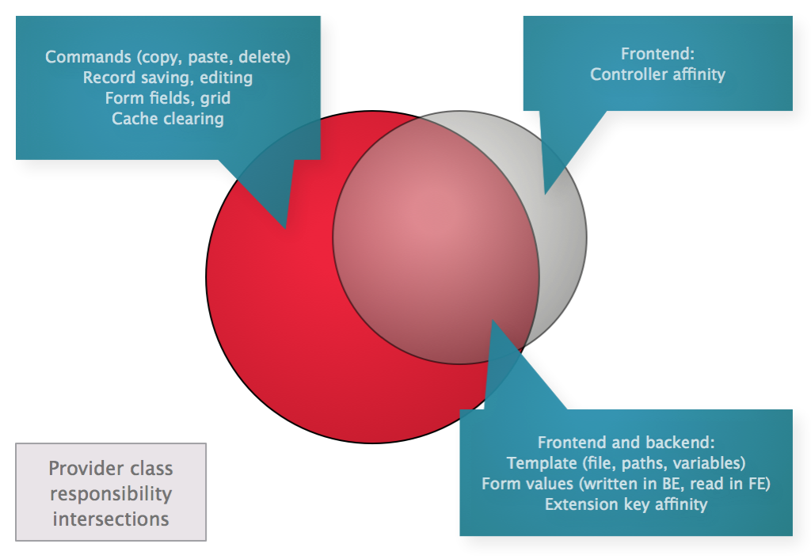

## 3.2.1 Use cases for custom Providers

A Provider is a class which:

1. Is always associated with one database table, fx `tt_content` or `pages` or your custom tables (one Provider per table).
2. Is resolved through Flux whenever a record from that table is edited, moved, saved, deleted, rendered etc.
3. Triggers (as in: processes records from the table it connects with) only under certain circumstances, for example when a
   `tt_content` record has a `list_type` that matches a particular plugin.
4. Contains a number of methods to get information based on one row from the table the Provider is connected with.
5. Contains a number of methods to manipulate records from the DB table it connects with.
6. Is used by [Flux-enabled controllers](FluxControllers.md) when these are rendered through frontend plugins to fetch important
   rendering-related information like which controller to use, which template file, the paths for the View object, etc.

For example, the `fluidcontent` Provider - named `ContentProvider` - connects with the `tt_content` table and is triggered only
when the `CType` value of the record matches `fluidcontent_content` (which is the plugin signature name for `fluidcontent`).
This Provider gets used in the backend to resolve a `FluidTYPO3\Flux\Form` instance based on which specific `fluidcontent`
element you select. It reads values which were stored in the record by filling and saving the Flux form. It reacts to cache
clearing (by refreshing the stored definitions of available `fluidcontent` templates) and finally, it is integrated in the
`ContentController` from `fluidcontent` which renders each element - here, in the controller, it is used to return variables,
template paths, desired controller name and controller extension name, and so on. Flux then uses these variables and settings
to route the request to the proper controller based on extension name etc. (`fluidcontent` uses this to make it possible to add
your own `ContentControllers` in other extensions; and since your `fluidcontent` element is identified by a combination of
extension key and template name, Flux (by getting extension key based on a record from `tt_content`, in this case taken from
the combined `fluidcontent` template identifier which can fx be `fluidcontent_bootstrap:Alert.html` and then detecting a class
name of a controller to which the rendering should be delegated).

You can see the Provider pattern in full effect in `fluidcontent` - and you can see the

## Why use a Provider - and when?

Provider classes are meant to be the connection between backend and frontend - but you can also use them exclusively in the
backend or frontend as you like. The main benefit comes when you also use a [Flux-enabled controller](FluxControllers.md) in an
Extbase plugin - when you do this, the Provider acts as the link between your records and the template file, paths, variables
and so on that your controller should use when rendering each record.

The intersection diagram below shows how much of a Provider's feature set is related to backend, frontend and both:

Some methods are dedicated to manipulating the records and performing actions when records are manipulated; others are dedicated
to returning information about which controller class to use, from which extension and so on. These methods then share a set of
utility-type methods - getting a template filename, getting template paths, getting Flux form variables from a record etc.

Flux is then able to use your Provider automatically when your controller is a [Flux-enabled controller](FluxControllers.md). If
if it not, you can still use your Provider in controllers but must then manually perform rendering: manually assign variables
returned from the Provider to the View, manually forward to other controllers if this applies in your application, and more along
those lines. Basically, not using a [Flux-enabled controller](FluxControllers.md) means that every interaction with your Provider
_when in a frontend context_ must be done manually. Flux will still, however, trigger all backend-related functions of your
Provider class regardless of having a controller or not.

All in all this makes the Provider _the_ place to return dynamic returns for template, paths, rendering variables. Since the
Provider gets used in both frontend and backend, the return values will be consistent in both places.

## What should a Provider contain?

The `FluidTYPO3\Flux\Provider\ProviderInterface` defines many different functions which are all available when you subclass
`FluidTYPO3\Flux\Provider\AbstractProvider`. You can override any of these methods - as needed - when for example your Provider
should react to records being saved, or when you need to return a custom template file or custom template variables (the Provider
does much, much more than these few examples - you can investigate the interface and base class for detailed doc comments; these
are also visible if you use an IDE and then subclass/implement the mentioned class/interface).

In order to define which DB table name and which field name (if any) your Provider should connect with, use the class properties
you see in `AbstractProvider` - named `tableName`, `fieldName` and so on. For example, Flux's `ContentProvider` connects with the
`tt_content` table when the field `pi_flexform` is involved and when the `CType` (in the Provider class called `contentObjectType`)
matches `fluidcontent_content`. Using `NULL` as value of any of these fields means your Provider is a general, _but lower priority_
match for records from the associated DB table. And that means, if another Provider class has a more specific match (for example,
if it includes a `fieldName` to also match) then it gets resolved first and your Provider get resolved after it.

Finally, there is a `priority` setting which can even further increase or decrese the proirity of your Provider for records in
the table it connects with. The default is `50` and can be lowered to make the Provider less important and raised if more important.

In some cases - such as `tt_content` preview rendering in the page module - the first Provider which renders a preview also is
able to stop other Providers from rendering theirs; which means that in particular when your Provider connects with the
`tt_content` table, you must be a bit more careful not to override the priority of fx `fluidcontent`'s ContentProvider - or you
could prevent the nested content grids from being displayed.

## What should a Provider not contain?

In order to _separate concerns_ of your application, your Provider's main responsibility should be to _delegate_ to other methods.
For example, a Provider could...

* Inject Services from your application which manipulates records.
* Use the ConfigurationManager to insert TypoScript in template variables from multiple locations.
* Dynamically remove and change template variables before they reach the Controller.
* Dynamically change the template paths your [Flux-enabled controller](FluxControllers.md) should use.
* Switch the template file your Controller renders, based on values in the record it renders.
* Return a custom `FluidTYPO3\Flux\Form` instance built directly in PHP.
* Configure some (not all!) aspects of the controller context - the extension key, the `$this->settings` storage, and more.

But it should not...

* Contain larger pieces of business logic, for example to manipulate records in complicated ways.
* Use specialised methods which only work in backend or frontend.

Along with the better _separation of concern_ a Provider is also easy to write unit tests for. And, since it works the same way in
both frontend and backend, ensuring that it connects properly in one context also means it connects properly in others. Since it
mainly delegates to Services and other classes, it becomes easy to mock those so-called "fan-outs" in tests. Finally, it removes
some of the usually necessary code from controller classes into more a separate, much more test friendly context. As a bonus, Flux
provides a base unit test class which when used, should immediately cover a lot of the custom methods you choose to add. This class
is called `FluidTYPO3\Flux\Tests\Unit\Provider\AbstractProviderTestCase` and can be easily subclassed in your own unit test.

## Providers with Outlets and Pipes

Before reading this section you should take a look at the [Outlets and Pipes concept](OutletsAndPipes.md) to make yourself familiar
with this concept. In summary: Pipes are a type of class which takes data in one function, "does something" and returns the same
or other data - and Outlets are a type of class which has two sets of Pipes attached: input and output. Outlets then use the Pipes
added to input when it accepts data (to perform fx validation and cleaning input data) and uses Pipes again to output data (to fx
save to a file, send an email, save a DB record - and more). Both Outlets and Pipes are completely replacable and can be custom
built to fit just your purposes. They are ideally easy to test using unit tests.

So, how does a Provider use Outlets and Pipes? Very simple: if the Form instance returned by a Provider contains an Outlet, this
Outlet gets called and then calls the attached Pipes, _when a record is saved in the backend_. Naturally this behavior can also be
changed or disabled - generally speaking, creating your own Provider class lets you override any number of methods to change or
disable individual behaviors. Including all aspects of how your Provider uses Outlets.