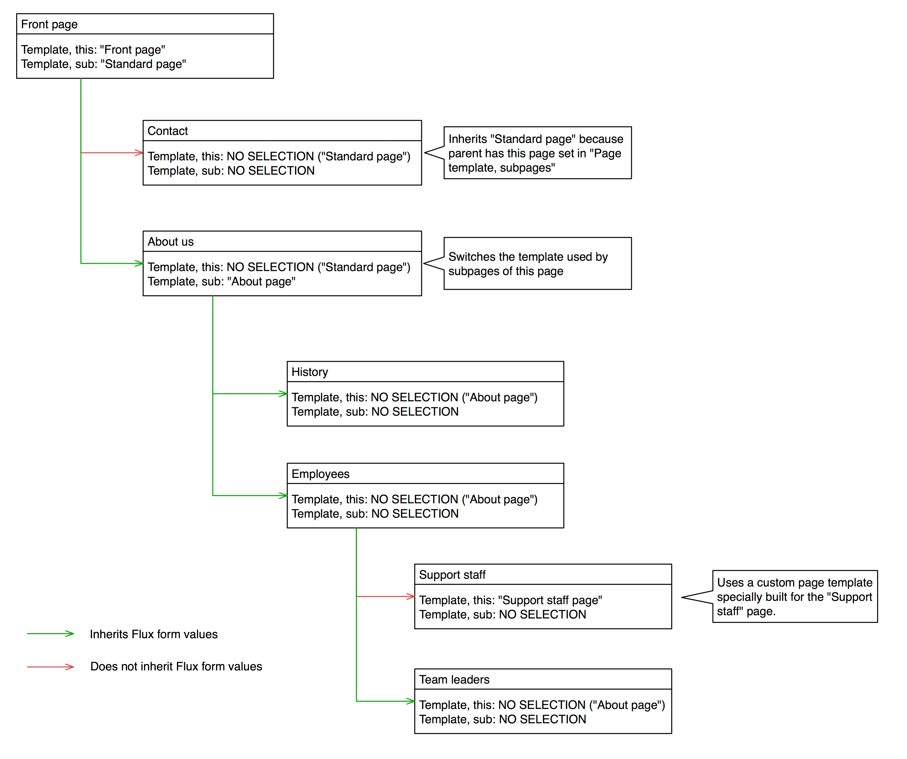

3.3.2 Page Template Inheritance
===============================

Fluidpages supports inheritance of not only page templates but also the variables entered in page properties (much like traditional value sliding, except also supporting merging of Flux form data). The inheritance works in a very similar way to TemplaVoilá - there is one field to select which template is used on the current page being edited, and another field to select which template all subpages of that page should use. When page templates match, the Flux form variables of parent pages are inherited on all child pages.

> Note: technically this inheritance works by _trimming the Flux form data_ before it is saved, so that the saved value only contains the _values which are different_. Because of this, moving a page to another branch of the page tree has the effect that the page is then rendered inheriting the **new** parent page's variables but retaining the values which were different from the **old** parent's values.

### Illustration of inheritance

### Clearing field values

A special `clear="TRUE/FALSE"` attribute exists on every Flux form field. Enabling this attribute for any field (with the exception of custom HTML fields which support no wizards) will add a small checkbox labeled "clear" next to the field. If checked when the record is saved, the value gets removed from the current page, thus resetting it to either the inherited value, the field's default value if field has one, or empty/NULL - in that order.

> Note: although variable inheritance from parent to child records can be enabled for any record type, this inheritance is _not enabled for content elements even though in Flux content elements have a clear relation that would allow inheritance_. The complexity and variety of content elements means it's too risky to always inherit values and/or unreasonably complex to define rules to govern the inheritance; and limiting parent-child inheritance only when content elements use the same template would be pointless. You can however always use `flux:form.data` to retrieve all variables of any parent by UID as stored in child records' `tx_flux_parent` field.
