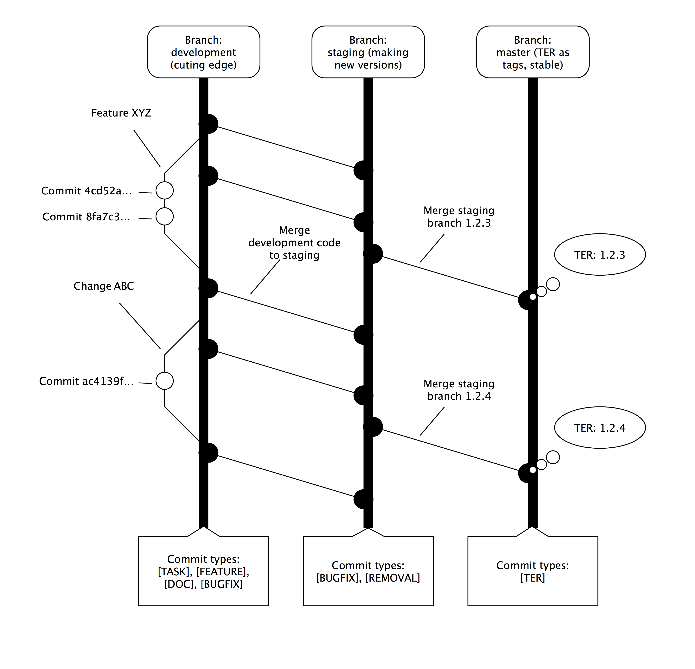

5.2 Git workflow
================

On behalf of the entire Fluid Powered TYPO3 team, thank you for wanting to contribute to our
projects - by creating issues, pull requests or just asking great support questions which
can help other users in the future.

This is the *ultra-compact* guide for that.

The following diagram shows our branch structure and how we work with them regarding commits,
merges and release preparation. You can also see which type of commit (for example, your
commits that you add and request that we merge) should go into which branch. Briefly put, you
should place bug fixes in the "staging" branch for the version to which your fix applies - and
you should create new features in the "development" branch. You can pull the "master" branch
and use it safely in production - it will always contain the most recent TER release state.



## Making Pull requests

Please make sure, you read the entire [Contribution Guide][contributionGuide] in advance.

We need to stress how important it actually is to contribute in feature-branches. This allows
you to keep your copy of flux in the master branch clean and to be the same as in our repository.
Start of by issueing ``git checkout -b myCoolFeature``.

Make one commit per change and one change per commit only. Example: if you are going to create
a particular feature and this feature requires a few changes to existing code to prepare for
the feature, first make individual commits with the required changes and then create your
"real" work on top of this.

So, you have prepared a nice bugfix to the latest version of flux and want that to be available
to anybody? Great! As we assume, you consumed the [Contribution Guide][contributionGuide]
to make your contribution follow best practices, everything should be fine.

In reality, we tend to be very picky concerning commit messages and our CGL. - Sir Travis
is also. He checks every commit message and wants to make sure, you applied the CGL to your
code. So what if he-or we-complain about findings in your code? Let us try to explain by
example:

### Example: The wrong commit message

So you hit the "wrong commit message" issue and we "force" you to change your commit
message(s). What now? GIT is magic but not that easy to learn. Lets say you have 2 commits.
This is what it would look like in the Pull-Request:

```
Author - Message (commit hash)
------------------------------
Cedric Ziel - a lead-haxor addition to flUx! (aaaaa)
Cedric Ziel - Fixing a docs-issue (bbbbb)
```

What's wrong? You know it-because you read the [guide][contributionGuide]! The commit
(I reference them by hash) aaaaa is lacking a prefix and an uppercase letter at the
beginning.

The optimal structure would be:

```
Author - Message (commit hash)
------------------------------
Cedric Ziel - [FEATURE] New property x added
Cedric Ziel - [DOC] Documenting feature y
```

So you need to ``reword`` (git slang) your last two commits.

To do this, you need to issue a ``rebase``:
```
git rebase -i HEAD~2 # this will issue an interactive rebase of the last 2 commits off from HEAD
# an editor will come up, showing your last 2 commits, change the first words from pick to reword
# save & exit
# another editor will come up for both commits, make the topic changes there, save & exit
# A message should be shown the rebase is complete
git push --force $GITHUBREMOTE $FEATUREBRANCHNAME
# $GITHUBREMOTE is most likely "origin" in your case if you didnt change anything
# $FEATUREBRANCHNAME is the name of your branch you made the changes on
# this will overwrite the remote's history entirely and the force is absolutely neccessary there
# The changes will shop up here immediately and Travis will try to build again
```

### Example: Refreshing your GitHub fork

As time goes by, you will certainly need to refresh your repo by pulling in remote changes.

For the sake of simplicity, we call the original FluidTYPO3 repositories our ``upstream`` remote.

To be able to actually refresh your fork, you could either delete it, or pull changes directly via
git. We recommend to do the following:

```
# Add the upstream repo as git remote
git remote add upstream https://github.com/FluidTYPO3/flux.git
# Go to your master branch
git checkout master
# Now, pull in changes from upstream. Rebase prevents merge commits and conflicts
git pull --rebase upstream master
# Up to date, yeah-unicorns everywhere!
```

We recommend to do this everytime you are about to start a new feature branch.

The full guide is available at https://fluidtypo3.org/documentation/contributing/contribution-guide.html

Last words: welcome to the growing list of contributors! :)

[contributionGuide]: https://fluidtypo3.org/documentation/contributing/contribution-guide.html "FluidTYPO3 contribution guide"
[pomodoro]: http://www.pomodorotechnique.com/ "The Pomodory Technique"

## Using Travis-CI

[Travis CI](https://travis-ci.org/) is a service that is free to use for OpenSource projects - what it provides is a way to run automated "builds" of your code, using scripts you can configure. It is possible to enable Travis checking for your personal fork of every Fluid Powered TYPO3 extension. To do this, simply sign up with Travis and connect your Github account. Travis then reads your repositories and presents you with options to toggle checking of each one of them.

Whenever you make pull requests, Travis will execute the build script and report any problems to you. [An example of a Travis build; for EXT:builder itself](https://travis-ci.org/FluidTYPO3/builder) and [the script which configures that build](https://github.com/FluidTYPO3/builder/blob/master/.travis.yml). When Travis is enabled for your local fork it allows you to run the exact same tests that would be run when you create a pull request - before you create the actual pull request. Thus giving you a perfect way to confirm your changes before publishing them.

Since even the most basic automated Travis-CI script written by EXT:builder will perform many tests on syntax in both PHP and Fluid you are highly encouraged to use Travis-CI. But you can of course also perform the tests as needed, simply by running the approproate CLI command from EXT:builder's list of commands and by using phpunit locally.

Continue: [Chapter 3.1.2: Extension scope explanation](../../3.Templating/3.1.ProviderExtension/3.1.2.ExtensionScopeExplanation).
